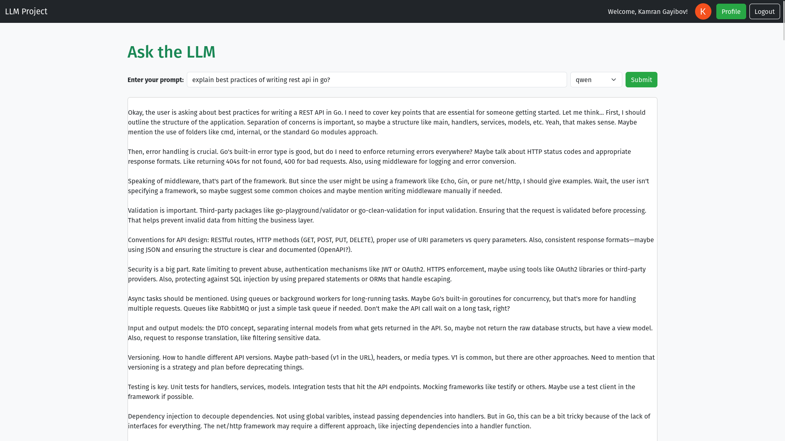
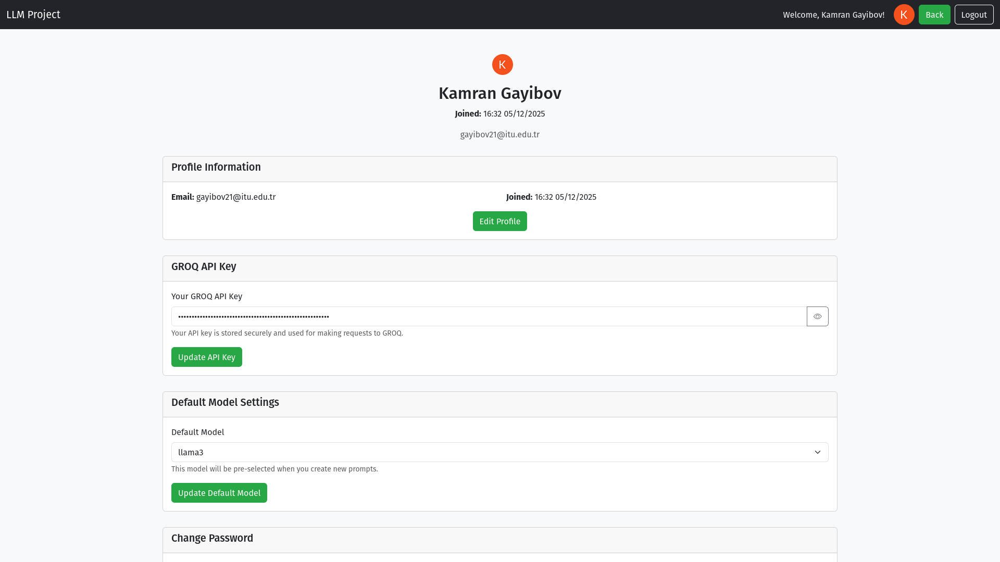

# LLM-Golang

Welcome to the LLM-Golang project! This web application allows users to interact with a large language model (LLM) through a user-friendly interface. It features GitHub OAuth for authentication, a responsive UI built with Bootstrap and HTMX, and seamless integration with a remote PostgreSQL database hosted on Neon Console.

---

## Features

- **User Authentication**: Secure login via GitHub OAuth.
- **Prompt Submission**: Easily submit prompts to an LLM and view responses.
- **Profile Management**: Manage user profiles with avatar, email, and username display.
- **Database Integration**: Store user information, prompts, and responses in a PostgreSQL database.
- **Dockerized Setup**: Fully containerized for consistent and reliable deployment.
- **Secure Configuration**: Use environment variables and Docker Secrets to manage sensitive data.

---

## Prerequisites

Before you begin, ensure you have the following:

- Docker and Docker Compose installed on your machine.
- Access to a PostgreSQL database (e.g., Neon Console).
- A GitHub OAuth App for authentication:
  - [Create a GitHub OAuth App](https://docs.github.com/en/developers/apps/building-oauth-apps/creating-an-oauth-app)

---

## Setup Instructions

### 1. Clone the Repository

```bash
git clone https://github.com/kaimg/LLM-Golang.git
cd LLM-Golang
```

### 2. Configure Environment Variables

Set up your environment variables and Docker Secrets as needed for your setup.

### 3. Start the Application

Use Docker Compose to build and run the application:

```bash
docker-compose up --build
```

---

## Screenshots

### Home Page


### Profile Page


---
